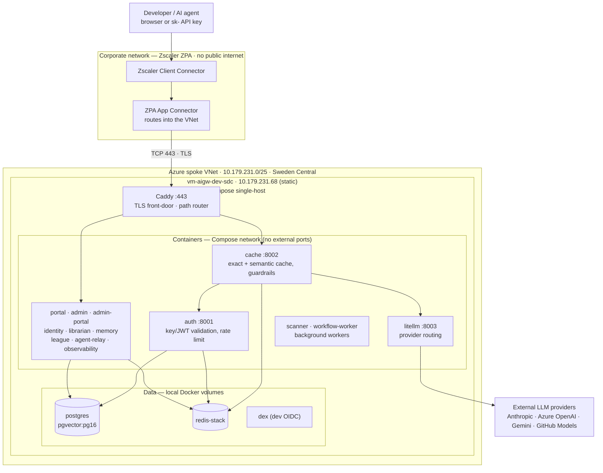
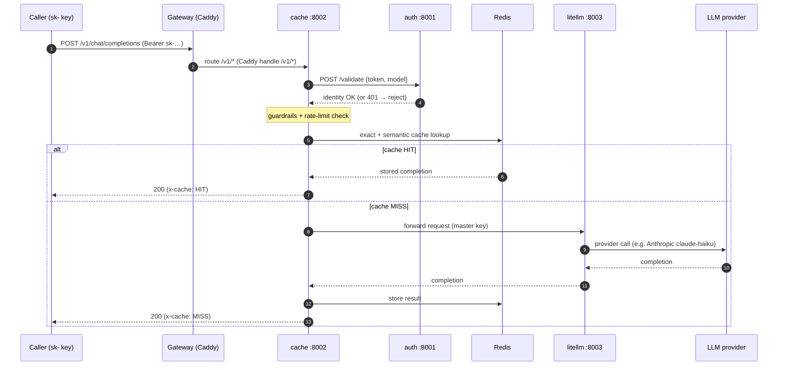
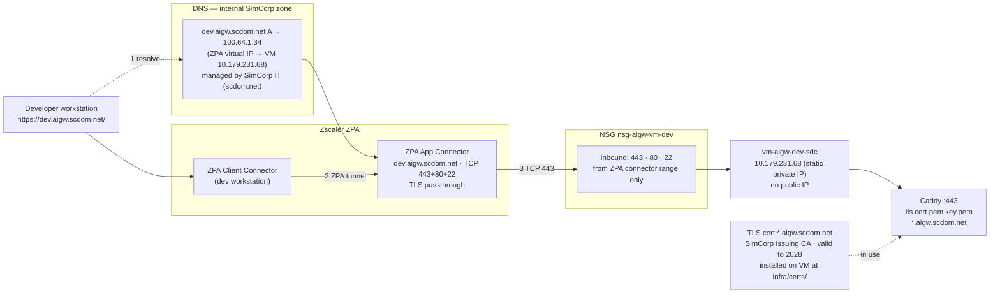

# ai-gw — Architecture Overview

A guide to what the AI Gateway is, the technologies it's built from, and how the pieces
hang together — from a developer's browser all the way to an LLM provider. Diagrams are
embedded as Mermaid (they render in GitHub/VS Code); rendered PNGs live alongside this file
in `docs/architecture/diagrams/`.

---

## 1. What it is

ai-gw is an **enterprise AI gateway** for ~2000 SimCorp engineers. It gives every developer
and AI agent a single, governed entry point to large language models: one OpenAI-compatible
API endpoint and a web portal, with **authentication, rate limiting, caching, provider
routing, observability, and guardrails** applied centrally instead of in every app.

It is a set of small **FastAPI** (Python) microservices plus two **Next.js** web apps.

**Current deployment (live):** Docker Compose on a single Linux VM
(`vm-aigw-dev-sdc`, `10.179.231.68`) in the dev Landing Zone spoke VNet — no ACA, no managed
PaaS. Reached at `https://dev.aigw.scdom.net` over Zscaler ZPA. See
[`dev-environment.md`](dev-environment.md) for the full deployment picture.

**Deferred target (V2 / prod):** Azure Container Apps (ACA) in the SimCorp Landing Zone
(Sweden Central), with managed PostgreSQL, Redis, Key Vault, and Service Bus reached over
private endpoints. The Bicep IaC is in-repo and ready for promotion but not currently running —
see [`environments.md`](environments.md).

---

## 2. Technology stack

| Layer | Technology | Role |
|---|---|---|
| Front-door / router | **Caddy** | TLS termination + path-based reverse proxy |
| Backend services | **FastAPI** (Python, async) | 12 request-path + 2 worker services |
| Web apps | **Next.js** | Developer portal + admin portal |
| Provider routing | **LiteLLM** | OpenAI-compatible facade over Anthropic, Azure OpenAI, Gemini, GitHub Models |
| **Hosting (current)** | **Docker Compose on Linux VM** | Single-host; `vm-aigw-dev-sdc` (10.179.231.68) |
| **Hosting (deferred V2)** | **Azure Container Apps** | Serverless containers, internal ACA env, scale-to-N |
| Datastore | **PostgreSQL** (pgvector:pg16) | Teams, API keys, registries, memory; Docker volume in dev, Flexible Server in prod |
| Cache | **Redis** (redis-stack) | Exact + semantic response cache, rate-limit counters; Docker volume in dev |
| Secrets | **`.env` file** (current) / **Azure Key Vault** (V2) | Provider keys + service config |
| Edge access | **Zscaler ZPA** | Brokers corp clients to the VNet (no public internet) |
| CI / images | **GitHub Actions** + **GHCR** | `master` push → build/push images → VM pulls |
| IaC (deferred V2) | **Bicep** | Declarative ACA infra; in-repo, ready for promotion |

---

## 3. The big picture

How everything hangs together — from a developer on the corporate network to the LLM
providers, through the gateway and the shared managed services.

**Reading it:** corp clients never touch the public internet — Zscaler ZPA brokers them
into the VNet to `10.179.231.68`. Only **Caddy** is exposed (ports 443 and 80); every other
container is bound to `127.0.0.1` and reachable only inside the VM. Services discover each
other by container name. Data lives in local Docker volumes; secrets come from `.env`. See
[`dev-environment.md`](dev-environment.md) for the full container inventory and deployment guide.

---

## 4. How an inference request flows

The hot path — `POST /v1/chat/completions`. Note the gateway sends `/v1` straight to
**cache**, which is the orchestrator: it validates the key (calling **auth**, with a
45-second in-process identity-cache fallback so brief auth blips don't break agents), runs
guardrails, checks Redis, and only calls **litellm** on a cache miss.

Other paths are simpler: `/` (and everything unmatched) routes to the developer **portal**;
`/admin*` routes to the **admin-portal** (prefix kept, required by its Next.js `basePath`);
`/auth/*` and `/agent-relay/*` keep their prefix. Backend service APIs live under
`/api/<svc>/*` (for `admin`, `cache`, `litellm`, `identity`, `librarian`, `memory`, `league`,
`observability`) — Caddy strips the `/api/<svc>` prefix so the FastAPI services see their root.
Full routing table: [`dev-environment.md#caddy-routing`](dev-environment.md#caddy-routing).

---

## 5. The access edge (how you reach it)

**Internal-only** — there is no public endpoint. Three mechanisms cooperate in the
single-host deployment. See [`dev-environment.md`](dev-environment.md) for credentials and access details.

1. **DNS** — the internal scdom.net zone resolves `dev.aigw.scdom.net` to the ZPA virtual IP
   `100.64.1.34`, which ZPA forwards to the VM at `10.179.231.68`. No public A record; no asuid
   TXT needed because we're not using ACA domain binding.
2. **Zscaler ZPA** brokers the corp client into the VNet with TLS passthrough (no inspection).
   The VM has no public IP — ZPA is the only path in.
3. **NSG `nsg-aigw-vm-dev`** allows 443, 80, and 22 inbound from the ZPA connector range only.
   TLS terminates at **Caddy** on the VM (wildcard `*.aigw.scdom.net`, SimCorp Issuing CA); all
   services behind it are on `127.0.0.1`.

---

## 6. Shared platform services

**Dev (current):** all data services run as Docker containers on the same VM with local volumes.

- **postgres** (`pgvector/pgvector:pg16`) — the system of record: organization nodes, API keys, agent registry, persistent memory, league data. Most services use SQLAlchemy + asyncpg; litellm uses Prisma (note: it needs a plain `postgresql://` URL — no `+asyncpg` driver prefix).
- **redis** (`redis/redis-stack:7.2.0-v14`) — exact + semantic response cache, rate-limit counters, developer session tokens.
- **dex** (`dexidp/dex:v2.40.0`) — local OIDC provider for portal/admin dev authentication.

**Target (Phase 2 — Azure managed PaaS):** PostgreSQL Flexible Server, Cache for Redis, and Service Bus, all behind private endpoints. Connection strings injected from Key Vault via managed identity — no secrets on disk.

---

## 7. Security & identity model

- **Two credential types:** end users carry JWTs; agents/apps carry `sk-` API keys. `auth`
  validates a key purely by `sha256(raw key)` against `api_keys` where `revoked_at IS NULL`.
- **Secrets handling:** in the current single-host deployment provider keys and DB strings come
  from a VM-local `.env` (gitignored, mode 0600) and live only in process memory at runtime. In
  the deferred V2 (ACA), every app reads them from Key Vault via its managed identity.
- **Network isolation:** the VM has no public IP and only Caddy is exposed; all services bind
  `127.0.0.1`. Zscaler ZPA is the only path in (no public endpoint), which is why the edge in §5
  is shaped the way it is. The V2 (ACA) target tightens this further with an internal-only ACA
  environment and private endpoints for all PaaS.
- **Guardrails** run in `cache` on the request body before anything is forwarded to a provider.

---

## 8. Observability

Request-path services (`auth`, `cache`, `admin`, …) are instrumented with **OpenTelemetry**.
OTel export to **Application Insights** (`appi-aigw-dev-sdc`) is env-gated and fail-safe — it
activates in the V2 (ACA) target where the connection string comes from Key Vault. In the
current single-host deployment, usage/cost events flow through the `observability` service for
async aggregation. This gives end-to-end visibility — which key, which model, cache hit/miss,
latency, cost — for diagnostics.

---

## 9. Deployment & CI

**Current (single-host, pull-based):**
- **GitHub Actions** builds and pushes service images to **GHCR** on a push to `master`.
- The VM **pulls** the new images: routine single-service updates use
  `scripts/update-service.sh <svc>` (the static base — postgres/redis/dex/caddy — is untouched);
  a full deploy uses `scripts/deploy-vm.sh`. Host stand-up is intentionally manual, not IaC.
- Compose always runs with both files (`docker-compose.yml` + `docker-compose.host.yml`); the
  host overlay carries the GHCR `image:` keys.
- Frontend (Next.js) images are built outside the standard image job (pnpm monorepo).

**Deferred V2 (ACA):** **Bicep** describes the whole ACA topology — the environment, each
Container App, networking, private endpoints, the gateway + its Caddyfile, and certificate
bindings (`infra/bicep/`, entry `environments/dev/main.bicep`). The ACA CI/CD workflows are
archived in `.github/workflows/_archived/` and do not run. See
[`environments.md`](environments.md).

---

## 10. The 14 services at a glance

| Service | Port | Purpose |
|---|---|---|
| caddy | 80/443 | Caddy front-door: path routing, TLS edge |
| auth | 8001 | JWT / API-key validation, rate limiting; inference gatekeeper |
| cache | 8002 | Semantic + exact cache, guardrails, request orchestration |
| litellm | 8003 | OpenAI-compatible provider routing |
| observability | 8004 | Async usage/cost event ingestion |
| admin | 8005 | Team management, API keys, dashboards |
| identity | 8006 | Agent registry — DNS-style resolve, heartbeat TTL |
| agent-relay | 8007 | WebSocket relay bus for agentic workflows |
| librarian | 8008 | Knowledge ingestion, chunking, semantic search |
| memory | 8009 | Persistent agent memory scoped to user/team |
| league | 8010 | AI-League gamified challenge platform |
| portal | 3002 | Developer-facing Next.js app |
| admin-portal | 3001 | Admin Next.js app |
| scanner | — | Background security-scanning worker |
| workflow-worker | — | Background agentic-workflow runner |
