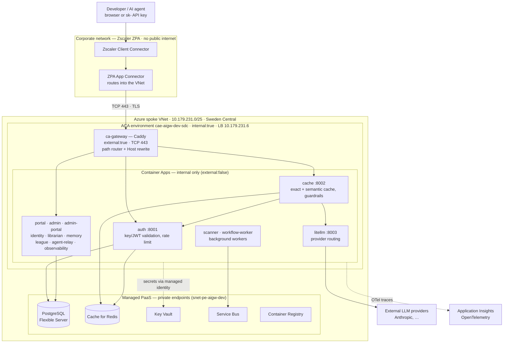
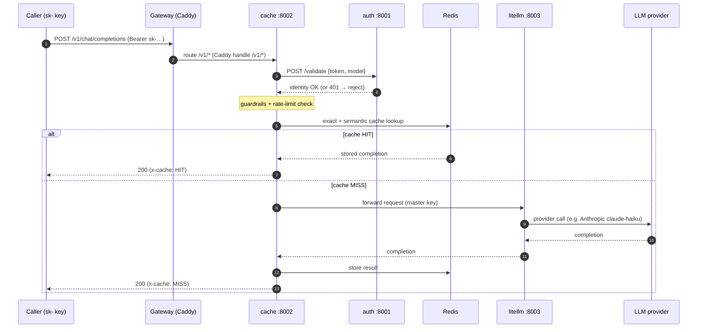
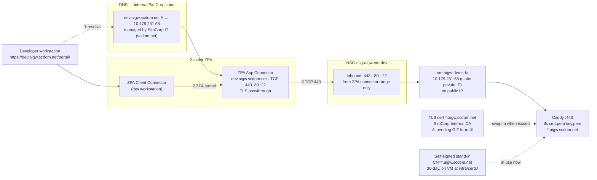

# ai-gw — Architecture Overview

A guide to what the AI Gateway is, the technologies it's built from, and how the pieces
hang together — from a developer's browser all the way to an LLM provider. Diagrams are
embedded as Mermaid (they render in GitHub/VS Code); rendered PNGs live alongside this file
in `docs/architecture/diagrams/`.

---

## 1. What it is

ai-gw is an **enterprise AI gateway** for ~2000 SimCorp engineers. It gives every developer
and AI agent a single, governed entry point to large language models: one OpenAI-compatible
API endpoint and a web portal, with **authentication, rate limiting, caching, provider
routing, observability, and guardrails** applied centrally instead of in every app.

It is a set of small **FastAPI** (Python) microservices plus two **Next.js** web apps.

**Current deployment (dev / stabilisation phase):** Docker Compose on a single Linux VM
(`vm-aigw-dev-sdc`, `10.179.231.68`) in the dev Landing Zone spoke VNet — no ACA, no managed
PaaS. See [`dev-environment.md`](dev-environment.md) for the full deployment picture.

**Target deployment (Phase 2):** Azure Container Apps (ACA) in the SimCorp Landing Zone
(Sweden Central), with managed PostgreSQL, Redis, Key Vault, and Service Bus reached over
private endpoints.

---

## 2. Technology stack

| Layer | Technology | Role |
|---|---|---|
| Layer | Technology | Role |
|---|---|---|
| Front-door / router | **Caddy** | TLS termination + path-based reverse proxy |
| Backend services | **FastAPI** (Python, async) | 12 request-path + 2 worker services |
| Web apps | **Next.js** | Developer portal + admin portal |
| Provider routing | **LiteLLM** | OpenAI-compatible facade over Anthropic, Azure OpenAI, Gemini, GitHub Models |
| **Dev hosting** | **Docker Compose on Linux VM** | Single-host stabilisation; `vm-aigw-dev-sdc` (10.179.231.68) |
| **Target hosting** | **Azure Container Apps** | Serverless containers, internal ACA env, scale-to-N |
| Datastore | **PostgreSQL** (pgvector:pg16) | Teams, API keys, registries, memory; Docker volume in dev, Flexible Server in prod |
| Cache | **Redis** (redis-stack) | Exact + semantic response cache, rate-limit counters; Docker volume in dev |
| Secrets | **`.env` file** (dev) / **Azure Key Vault** (prod) | Provider keys + service config |
| Edge access | **Zscaler ZPA** | Brokers corp clients to the VNet (no public internet) |
| IaC / CI | **Bicep** + **GitHub Actions** | Declarative infra; build/push images; deploy on `master` |

---

## 3. The big picture

How everything hangs together — from a developer on the corporate network to the LLM
providers, through the gateway and the shared managed services.

**Reading it (dev):** corp clients never touch the public internet — Zscaler ZPA brokers them
into the VNet to `10.179.231.68`. Only **Caddy** is exposed (ports 443 and 80); every other
container is bound to `127.0.0.1` and reachable only inside the VM. Data lives in local Docker
volumes; secrets come from `.env`. See [`dev-environment.md`](dev-environment.md) for the
full container inventory and deployment guide.

---

## 4. How an inference request flows

The hot path — `POST /v1/chat/completions`. Note the gateway sends `/v1` straight to
**cache**, which is the orchestrator: it validates the key (calling **auth**, with a
45-second in-process identity-cache fallback so brief auth blips don't break agents), runs
guardrails, checks Redis, and only calls **litellm** on a cache miss.

Other paths are simpler: `/portal*` and `/admin-portal*` use `handle` (prefix kept, required
by Next.js `basePath`); `/admin`, `/identity`, `/librarian`, `/memory`, `/league`,
`/observability`, `/litellm`, `/agent-relay` use `handle_path` (prefix stripped, FastAPI
services see their root). Full routing table: [`dev-environment.md#caddy-routing-table`](dev-environment.md#caddy-routing-table).

---

## 5. The access edge (how you reach it)

**Internal-only** — there is no public endpoint. Three mechanisms cooperate in the current
single-host deployment. See [`dev-environment.md#access-edge`](dev-environment.md#access-edge----pending-it-forms) for the pending IT forms.

1. **DNS** — the internal scdom.net zone resolves `dev.aigw.scdom.net` to `10.179.231.68`
   (static private IP). No public A record; no asuid TXT needed because we're not using ACA
   domain binding.
2. **Zscaler ZPA** brokers the corp client into the VNet with TLS passthrough (no inspection).
   The VM has no public IP — ZPA is the only path in.
3. **NSG `nsg-aigw-vm-dev`** allows 443, 80, and 22 inbound from the ZPA connector range only.
   TLS terminates at **Caddy** on the VM; all services behind it are on `127.0.0.1`.

---

## 6. Shared platform services

**Dev (current):** all data services run as Docker containers on the same VM with local volumes.

- **postgres** (`pgvector/pgvector:pg16`) — the system of record: organization nodes, API keys, agent registry, persistent memory, league data. Most services use SQLAlchemy + asyncpg; litellm uses Prisma (note: it needs a plain `postgresql://` URL — no `+asyncpg` driver prefix).
- **redis** (`redis/redis-stack:7.2.0-v14`) — exact + semantic response cache, rate-limit counters, developer session tokens.
- **dex** (`dexidp/dex:v2.40.0`) — local OIDC provider for portal/admin dev authentication.

**Target (Phase 2 — Azure managed PaaS):** PostgreSQL Flexible Server, Cache for Redis, and Service Bus, all behind private endpoints. Connection strings injected from Key Vault via managed identity — no secrets on disk.

---

## 7. Security & identity model

- **Two credential types:** end users carry JWTs; agents/apps carry `sk-` API keys. `auth`
  validates a key purely by `sha256(raw key)` against `api_keys` where `revoked_at IS NULL`.
- **No secrets at rest:** every app uses its **managed identity** to read Key Vault; provider
  keys and DB strings live only in Key Vault and in process memory at runtime.
- **Network isolation:** internal-only ACA environment, private endpoints for all PaaS, and
  Landing-Zone Azure Policy enforcing "no public endpoints" + "TLS required" (which is why the
  edge in §5 is shaped the way it is).
- **Guardrails** run in `cache` on the request body before anything is forwarded to a provider.

---

## 8. Observability

Request-path services (`auth`, `cache`, `admin`, …) are instrumented with **OpenTelemetry**,
exporting traces/metrics to **Application Insights** (`appi-aigw-dev-sdc`; connection string
in Key Vault, env-gated and fail-safe). Usage/cost events also flow through the
`observability` service via Service Bus for async aggregation. This gives end-to-end
visibility — which key, which model, cache hit/miss, latency, cost — for diagnostics.

---

## 9. Deployment & CI

- **Bicep** describes everything: the ACA environment, each Container App, networking,
  private endpoints, the gateway + its Caddyfile, and certificate bindings
  (`infra/bicep/`, entry `environments/dev/main.bicep`).
- **GitHub Actions** builds and pushes service images to ACR, then `deploy.yml` deploys them
  on a push to `master` via `az deployment group create … --parameters imageTag=sha-<sha>`.
- Frontend (Next.js) images are built outside the standard image job (pnpm monorepo).

---

## 10. The 14 services at a glance

| Service | Port | Purpose |
|---|---|---|
| ca-gateway | 443/8080 | Caddy front-door: path routing, Host rewrite, TLS edge |
| auth | 8001 | JWT / API-key validation, rate limiting; inference gatekeeper |
| cache | 8002 | Semantic + exact cache, guardrails, request orchestration |
| litellm | 8003 | OpenAI-compatible provider routing |
| observability | 8004 | Async usage/cost event ingestion |
| admin | 8005 | Team management, API keys, dashboards |
| identity | 8006 | Agent registry — DNS-style resolve, heartbeat TTL |
| agent-relay | 8007 | WebSocket relay bus for agentic workflows |
| librarian | 8008 | Knowledge ingestion, chunking, semantic search |
| memory | 8009 | Persistent agent memory scoped to user/team |
| league | 8010 | AI-League gamified challenge platform |
| portal | 3002 | Developer-facing Next.js app |
| admin-portal | 3001 | Admin Next.js app |
| scanner | — | Background security-scanning worker |
| workflow-worker | — | Background agentic-workflow runner |
