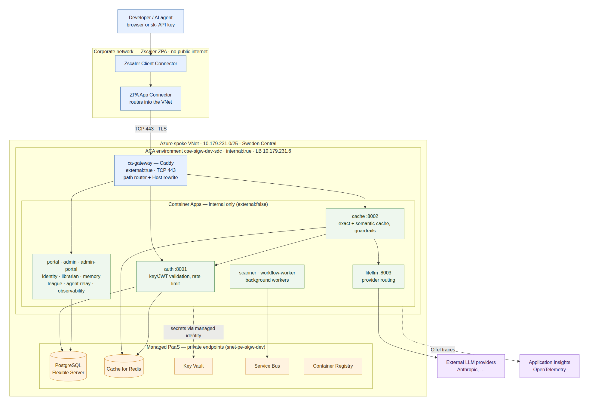
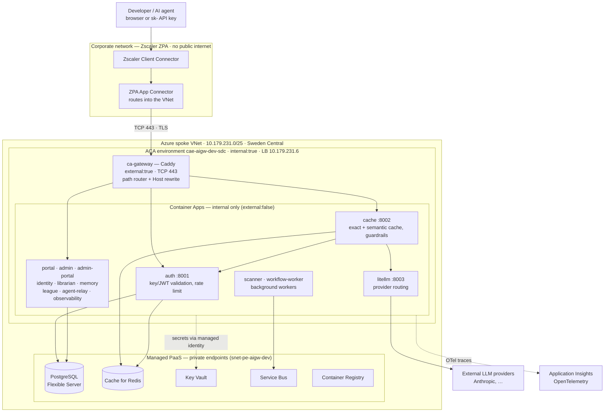
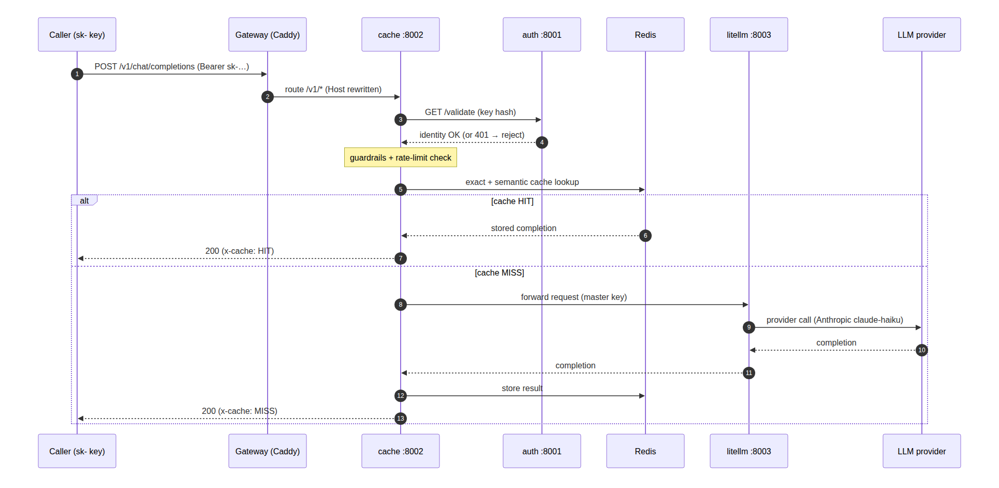
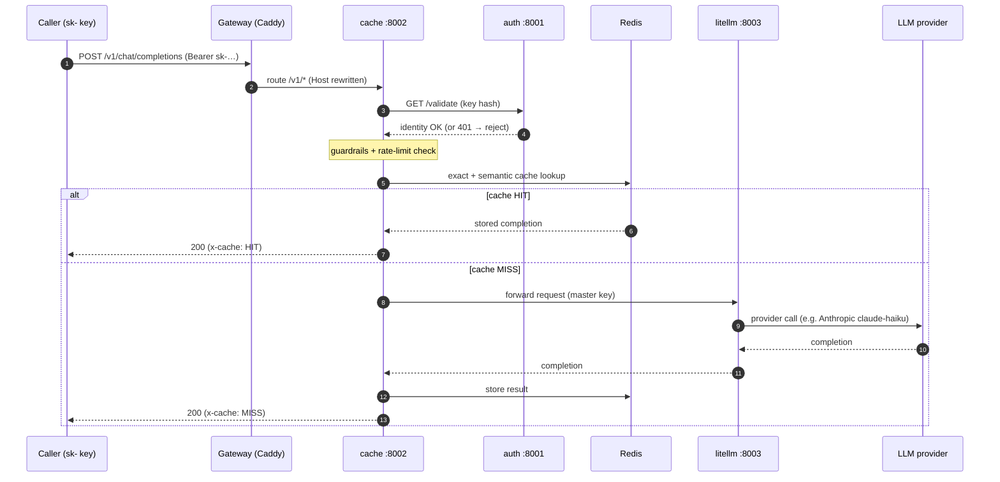
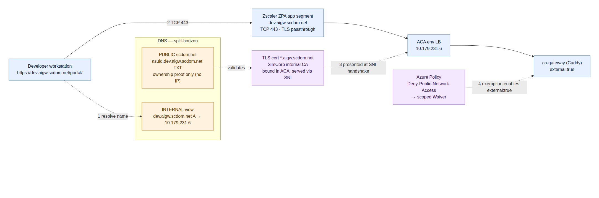
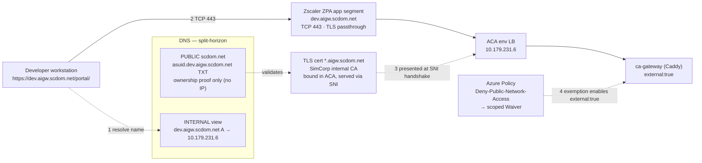

# ai-gw — Architecture Overview

A guide to what the AI Gateway is, the technologies it's built from, and how the pieces
hang together — from a developer's browser all the way to an LLM provider. Diagrams are
embedded as Mermaid (they render in GitHub/VS Code); rendered PNGs live alongside this file
in `docs/architecture/diagrams/`.

---

## 1. What it is

ai-gw is an **enterprise AI gateway** for ~2000 SimCorp engineers. It gives every developer
and AI agent a single, governed entry point to large language models: one OpenAI-compatible
API endpoint and a web portal, with **authentication, rate limiting, caching, provider
routing, observability, and guardrails** applied centrally instead of in every app.

It is a set of small **FastAPI** (Python) microservices plus two **Next.js** web apps, all
running as **Azure Container Apps (ACA)** in SimCorp's Landing Zone (Sweden Central). There
is no local stack — everything runs on managed Azure PaaS reached over a private VNet.

---

## 2. Technology stack

| Layer | Technology | Role |
|---|---|---|
| Front-door / router | **Caddy** | Single reverse proxy; path-based routing, rewrites `Host` per upstream |
| Backend services | **FastAPI** (Python, async) | The 12 request-path + 2 worker services |
| Web apps | **Next.js** | Developer portal + admin portal |
| Provider routing | **LiteLLM** | OpenAI-compatible facade over Anthropic et al. |
| Hosting | **Azure Container Apps** | Serverless containers, internal env, scale-to-N |
| Datastore | **Azure Database for PostgreSQL** (Flexible Server) | Teams, API keys, registries, memory |
| Cache | **Azure Cache for Redis** | Exact + semantic response cache, rate-limit counters |
| Secrets | **Azure Key Vault** | Connection strings + provider keys, injected via Managed Identity |
| Async bus | **Azure Service Bus** | Event ingestion for observability + background workers |
| Images | **Azure Container Registry** | Service container images |
| Telemetry | **OpenTelemetry → Application Insights** | Traces/metrics from request-path services |
| Identity | **Managed Identity** | Apps authenticate to Key Vault/PaaS with no stored secrets |
| Edge access | **Zscaler ZPA** | Brokers corp clients to the internal VNet (no public internet) |
| Governance | **Azure Policy** | Landing-Zone guardrails (deny public endpoints, enforce TLS) |
| IaC / CI | **Bicep** + **GitHub Actions** | Declarative infra; build/push images; deploy on `master` |

---

## 3. The big picture

How everything hangs together — from a developer on the corporate network to the LLM
providers, through the gateway and the shared managed services.

**Reading it:** corp clients never touch the public internet — Zscaler ZPA brokers them into
the VNet to the ACA environment's single internal load-balancer IP (`10.179.231.6`). Only the
**Caddy gateway** is reachable there; every other service is `external:false` (VNet-internal,
app-to-app only). The gateway path-routes to services, which share managed PaaS over private
endpoints and pull their secrets from Key Vault using each app's **managed identity** (no
secrets on disk).

---

## 4. How an inference request flows

The hot path — `POST /v1/chat/completions`. Note the gateway sends `/v1` straight to
**cache**, which is the orchestrator: it validates the key (calling **auth**, with a
45-second in-process identity-cache fallback so brief auth blips don't break agents), runs
guardrails, checks Redis, and only calls **litellm** on a cache miss.

Other paths are simpler: `/portal*` and `/admin-portal*` go to the Next.js apps; `/admin`,
`/identity`, `/librarian`, `/memory`, `/league`, `/observability`, `/litellm`, `/agent-relay`
each strip their prefix and go to the matching service. Because ACA's internal ingress routes
by **HTTP Host header**, Caddy rewrites `Host` to the target service name on every hop.

---

## 5. The access edge (how you reach it)

This is the layer designed in the
[GIT network-access request](../access/2026-06-17-git-network-access-request.md). It's
**internal-only** — there is no public endpoint. Four mechanisms cooperate:

1. **DNS (split-horizon):** the internal view resolves `dev.aigw.scdom.net` to the VNet LB
   IP; a single **public** `asuid` TXT record exists only so Azure can prove we own the name
   and issue/bind the certificate. No public A record, no public exposure.
2. **Zscaler ZPA** brokers the corp client into the VNet over TCP 443 with TLS passthrough
   (no inspection), so the browser completes TLS end-to-end with the backend.
3. **TLS certificate** — a wildcard `*.aigw.scdom.net` from the SimCorp internal CA, bound in
   ACA and presented by envoy via SNI; trusted automatically on corp-managed devices.
4. **Azure Policy** normally denies public network access on Container Apps; a scoped
   *Waiver* exemption lets only the gateway be `external:true`, which on an internal
   environment means **VNet-visible, not internet-exposed**.

---

## 6. Shared platform services (PaaS)

All managed services sit behind **private endpoints** in `snet-pe-aigw-dev`
(`10.179.231.64/26`); nothing is publicly reachable. Apps connect using connection strings
**injected from Key Vault via managed identity** at startup — no secrets are committed or
written to disk.

- **PostgreSQL Flexible Server** — the system of record: teams/organization nodes, API keys,
  the agent registry, persistent memory, league data. Most services use SQLAlchemy + asyncpg;
  litellm uses Prisma (note: it needs a plain `postgresql://…?sslmode=require` URL).
- **Cache for Redis** — exact + semantic response cache and rate-limit/budget counters.
- **Service Bus** — async event ingestion for observability and the background workers.
- **Container Registry** — holds the service images that CI builds and ACA pulls.

---

## 7. Security & identity model

- **Two credential types:** end users carry JWTs; agents/apps carry `sk-` API keys. `auth`
  validates a key purely by `sha256(raw key)` against `api_keys` where `revoked_at IS NULL`.
- **No secrets at rest:** every app uses its **managed identity** to read Key Vault; provider
  keys and DB strings live only in Key Vault and in process memory at runtime.
- **Network isolation:** internal-only ACA environment, private endpoints for all PaaS, and
  Landing-Zone Azure Policy enforcing "no public endpoints" + "TLS required" (which is why the
  edge in §5 is shaped the way it is).
- **Guardrails** run in `cache` on the request body before anything is forwarded to a provider.

---

## 8. Observability

Request-path services (`auth`, `cache`, `admin`, …) are instrumented with **OpenTelemetry**,
exporting traces/metrics to **Application Insights** (`appi-aigw-dev-sdc`; connection string
in Key Vault, env-gated and fail-safe). Usage/cost events also flow through the
`observability` service via Service Bus for async aggregation. This gives end-to-end
visibility — which key, which model, cache hit/miss, latency, cost — for diagnostics.

---

## 9. Deployment & CI

- **Bicep** describes everything: the ACA environment, each Container App, networking,
  private endpoints, the gateway + its Caddyfile, and certificate bindings
  (`infra/bicep/`, entry `environments/dev/main.bicep`).
- **GitHub Actions** builds and pushes service images to ACR, then `deploy.yml` deploys them
  on a push to `master` via `az deployment group create … --parameters imageTag=sha-<sha>`.
- Frontend (Next.js) images are built outside the standard image job (pnpm monorepo).

---

## 10. The 14 services at a glance

| Service | Port | Purpose |
|---|---|---|
| ca-gateway | 443/8080 | Caddy front-door: path routing, Host rewrite, TLS edge |
| auth | 8001 | JWT / API-key validation, rate limiting; inference gatekeeper |
| cache | 8002 | Semantic + exact cache, guardrails, request orchestration |
| litellm | 8003 | OpenAI-compatible provider routing |
| observability | 8004 | Async usage/cost event ingestion |
| admin | 8005 | Team management, API keys, dashboards |
| identity | 8006 | Agent registry — DNS-style resolve, heartbeat TTL |
| agent-relay | 8007 | WebSocket relay bus for agentic workflows |
| librarian | 8008 | Knowledge ingestion, chunking, semantic search |
| memory | 8009 | Persistent agent memory scoped to user/team |
| league | 8010 | AI-League gamified challenge platform |
| portal | 3002 | Developer-facing Next.js app |
| admin-portal | 3001 | Admin Next.js app |
| scanner | — | Background security-scanning worker |
| workflow-worker | — | Background agentic-workflow runner |
