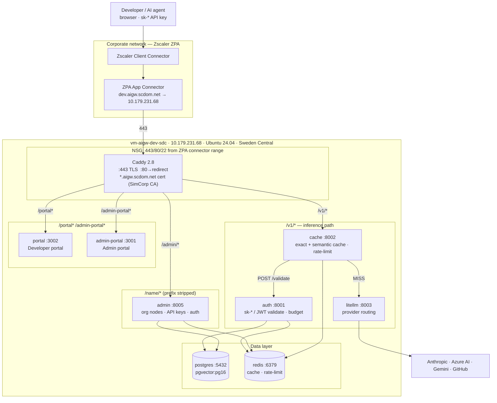

# Dev environment — single-host deployment

**Status:** Fully operational · updated 2026-06-19
**Host:** `vm-aigw-dev-sdc` · `10.179.231.68` (static private IP) · Sweden Central
**DNS:** `dev.aigw.scdom.net` → `100.64.1.34` (ZPA virtual IP) ✅ resolving from corp workstations
**TLS cert:** `*.aigw.scdom.net` — SimCorp Issuing CA, valid until 2028 ✅ installed
**ZPA:** TCP routing + TLS passthrough on 443/80/22 ✅ confirmed working
**SSH:** `ssh-aigw` helper (pass key `ssh/dev.aigw.scdom.net`) from AZWESU0005

---

## URLs

| Surface | URL | Credentials |
|---|---|---|
| Developer portal | `https://dev.aigw.scdom.net/portal/` | `pass show aigw/dev-portal` → `developer@aigw.scdom.net` |
| Admin portal | `https://dev.aigw.scdom.net/admin-portal/` | `pass show aigw/admin-portal` → `admin@aigw.scdom.net` |
| Inference API | `https://dev.aigw.scdom.net/v1/` | `sk-*` key — create via admin portal |
| Health check | `https://dev.aigw.scdom.net/healthz` | — |

---

## Overview

The dev environment runs the full ai-gw stack as a single Docker Compose project on one Linux VM in the Azure dev Landing Zone. Caddy terminates TLS and routes all traffic by path prefix. All service ports are bound to `127.0.0.1` (loopback) — only Caddy binds `0.0.0.0:443` and `0.0.0.0:80`.

ACA is in-repo and ready for V2/prod promotion — see `docs/architecture/environments.md`.

---

## Inference path

```
caller (Authorization: Bearer sk-...)
  → Caddy :443   /v1/chat/completions
  → cache :8002
      ↳ POST auth:8001/validate  {token, model}  → {team_id, key_id, scopes}  or 401/429
      ↳ Redis  exact-match lookup  (key = sha256(body))
           HIT  → return cached response  (x-cache: HIT, x-cache-stage: exact)
           MISS → POST litellm:8003/v1/chat/completions  (master key)
                  → Anthropic / Azure AI / Gemini / GitHub Models
                  ← response stored in Redis
                  ← return to caller  (x-cache: MISS)
```

Auth is a **validation oracle** called by cache — not the ingress. The caller never hits auth directly.

**Available models** (configured in `infra/litellm-config.yaml`):

| Model name | Provider |
|---|---|
| `claude-haiku-4-5` | Anthropic |
| `claude-sonnet-4-6` | Anthropic |
| `claude-opus-4-7` | Anthropic |
| `gemini-1.5-pro` | Gemini |
| `github-gpt-4o` | GitHub Models |
| `copilot-gpt-4o` | GitHub Copilot |
| `copilot-gpt-4o-mini` | GitHub Copilot |

---

## Container inventory

All 18 containers healthy (verified 2026-06-19):

| Container | Port (host) | Status |
|---|---|---|
| caddy | 0.0.0.0:443, 0.0.0.0:80 | Up |
| auth | 127.0.0.1:8001 | healthy |
| cache | 127.0.0.1:8002 | healthy |
| litellm | 127.0.0.1:8003 | healthy |
| observability | 127.0.0.1:8004 | healthy |
| admin | 127.0.0.1:8005 | healthy |
| identity | 127.0.0.1:8006 | healthy |
| agent-relay | 127.0.0.1:8007 | healthy |
| librarian | 127.0.0.1:8008 | healthy |
| memory | 127.0.0.1:8009 | healthy |
| league | 127.0.0.1:8010 | healthy |
| scanner | 127.0.0.1:8011 | healthy |
| portal | 127.0.0.1:3002 | healthy |
| admin-portal | 127.0.0.1:3001 | healthy |
| workflow-worker | — | Up |
| postgres | 127.0.0.1:5432 | healthy |
| redis | 127.0.0.1:6379 | healthy |
| dex | 127.0.0.1:5556 | Up |

---

## Compose files

| File | Purpose |
|---|---|
| `infra/docker-compose.yml` | Base — all 18 services |
| `infra/docker-compose.host.yml` | Host overlay — adds `caddy` with `0.0.0.0:443/80` |
| `infra/Caddyfile` | TLS + path-based routing to all services |
| `infra/certs/cert.pem` / `key.pem` | Wildcard cert (gitignored — extracted from pass) |
| `.env` | VM-local secrets (gitignored, mode 0600) |

Always run Compose with both files:
```bash
docker compose -f docker-compose.yml -f docker-compose.host.yml <command>
```

---

## Caddy routing

| Path | Target | Mode | Notes |
|---|---|---|---|
| `/v1/*` | `cache:8002` | `handle` | Inference entry — prefix kept |
| `/portal*` | `portal:3002` | `handle` | Next.js basePath must be kept |
| `/admin-portal*` | `admin-portal:3001` | `handle` | Next.js basePath must be kept |
| `/admin/*` | `admin:8005` | `handle_path` | Prefix stripped |
| `/auth/*` | `admin:8005` | `handle` | Admin serves login/OIDC at `/auth/*` |
| `/cache/*` | `cache:8002` | `handle_path` | Prefix stripped |
| `/litellm/*` | `litellm:8003` | `handle_path` | Prefix stripped |
| `/identity/*` | `identity:8006` | `handle_path` | Prefix stripped |
| `/librarian/*` | `librarian:8008` | `handle_path` | Prefix stripped |
| `/memory/*` | `memory:8009` | `handle_path` | Prefix stripped |
| `/league/*` | `league:8010` | `handle_path` | Prefix stripped |
| `/observability/*` | `observability:8004` | `handle_path` | Prefix stripped |
| `/agent-relay/*` | `agent-relay:8007` | `handle` | WebSocket — prefix kept |
| `/healthz` | `"ok" 200` | — | Caddy synthetic health probe |
| `/` | redirect `/portal/` | — | |

---

## Org structure and API key management

The org tree uses `organization_nodes`. Current structure:

```
SimCorp (company)    id: 1ff78788-938b-4e7d-bf81-24765ee48c41
└── Engineering (area)   id: 59b2b3a9-c2b4-49fb-819e-d91ef9446e10
    └── Platform Team (team)   id: b64d3801-f6b7-43f6-888f-5b37d9af9c99
```

To create an `sk-*` API key via the admin API (from the VM):

```bash
# 1. Log in and get a JWT
TOKEN=$(curl -s -X POST http://localhost:8005/auth/login \
  -H 'Content-Type: application/json' \
  -d '{"email":"admin@aigw.scdom.net","password":"<pass>"}' \
  | python3 -c "import sys,json; print(json.load(sys.stdin)['token'])")

# 2. Create the key for a team node
curl -s -X POST "http://localhost:8005/teams/<team-node-id>/keys" \
  -H "Authorization: Bearer $TOKEN" \
  -H 'Content-Type: application/json' \
  -d '{"name":"my-key","rate_limit_rpm":60}'
# → {"id":"...","key":"sk-...","scopes":["ai-gw:inference:*"],...}
```

`/teams/{team_id}/keys` uses the org node UUID as `team_id` — there is no separate `teams` table.

---

## How to manage the stack on the VM

```bash
# SSH (from AZWESU0005 — uses pass key)
ssh-aigw

# Or inline
eval $(ssh-agent -s) && pass show "ssh/dev.aigw.scdom.net" | ssh-add - && \
  ssh -o "IdentityAgent=$SSH_AUTH_SOCK" azureuser@10.179.231.68

# All compose commands run from /home/azureuser/ai-gw/infra
cd ~/ai-gw/infra

# Check service status
docker compose -f docker-compose.yml -f docker-compose.host.yml ps

# Restart a single service
docker compose -f docker-compose.yml -f docker-compose.host.yml up -d --no-deps <service>

# View logs
docker logs ai-gateway-<service>-1 --tail 50 -f

# Deploy the latest CI-built images (pull-based; host.yml carries GHCR image: keys)
docker compose -f docker-compose.yml -f docker-compose.host.yml pull
docker compose -f docker-compose.yml -f docker-compose.host.yml up -d
```

Prefer the scripts from an in-VNet host (both pull the GHCR token from `pass`):

- **`scripts/update-service.sh <svc…>`** — the routine, light path: pull + `up -d --no-deps` for
  just the named gateway service(s); the static base (postgres/redis/dex/caddy) is never touched.
- **`scripts/deploy-vm.sh [IMAGE_TAG]`** — the full path (`git pull` + pull-all + `up -d`) for
  multi-service, base, or compose changes.

---

## TLS certificate

The wildcard cert `*.aigw.scdom.net` is stored in `pass` as `certificate/wildcard.aigw.scdom.net.pfx.b64` (password: `certificate/wildcard.aigw.scdom.net`). It is installed on the VM at `~/ai-gw/infra/certs/cert.pem` and `key.pem` (gitignored).

To reinstall after expiry:

```bash
PFX_PASS=$(pass show certificate/wildcard.aigw.scdom.net | head -1)
# Extract and pipe cert to VM without writing to disk
{
  pass show "certificate/wildcard.aigw.scdom.net.pfx.b64" | base64 -d | \
    openssl pkcs12 -clcerts -nokeys -passin "pass:$PFX_PASS" -legacy | \
    openssl x509
} | ssh azureuser@10.179.231.68 "cat > ~/ai-gw/infra/certs/cert.pem"

{
  pass show "certificate/wildcard.aigw.scdom.net.pfx.b64" | base64 -d | \
    openssl pkcs12 -nocerts -nodes -passin "pass:$PFX_PASS" -legacy | \
    openssl pkey
} | ssh azureuser@10.179.231.68 "cat > ~/ai-gw/infra/certs/key.pem"

ssh azureuser@10.179.231.68 "cd ~/ai-gw/infra && \
  docker compose -f docker-compose.yml -f docker-compose.host.yml restart caddy"
```

---

## Provider API keys

Provider keys live in `/home/azureuser/ai-gw/.env` on the VM (gitignored). To update:

```bash
# From AZWESU0005 — example: update Anthropic key
NEW_KEY=$(pass show "api/antrophic API" | head -1)
echo "$NEW_KEY" | ssh azureuser@10.179.231.68 "python3 -c \"
import sys; key = sys.stdin.readline().strip()
with open('/home/azureuser/ai-gw/.env', 'r') as f: lines = f.readlines()
with open('/home/azureuser/ai-gw/.env', 'w') as f:
    f.writelines('ANTHROPIC_API_KEY=' + key + '\n' if l.startswith('ANTHROPIC_API_KEY=') else l for l in lines)
\""
ssh azureuser@10.179.231.68 "cd ~/ai-gw/infra && \
  docker compose -f docker-compose.yml -f docker-compose.host.yml up -d --no-deps litellm"
```

---

## Known bugs fixed (2026-06-19)

**`can_access("/")` sentinel** — `services/admin/app/routers/unified_auth.py`  
Root nodes are stored with UUID-based paths (`/uuid`), not the literal `"/"`. The platform admin check `can_access(user, "/", "platform_admin")` always returned `False`. Fixed by treating `"/"` as a root sentinel that matches any role at a single-segment path (`node_path.count("/") == 1`). Commit `17e3ab6`.

**Portal `NEXT_PUBLIC_*` baked with ACA URL** — `Dockerfile.portal`, `Dockerfile.admin`  
Both Dockerfiles defaulted `ARG NEXT_PUBLIC_*` to `aigw-dev.lab.cloud.scdom.net`. Portals loaded but all API calls failed. Fixed by updating ARG defaults to `dev.aigw.scdom.net`. Commit `a387a22`.

---

## Deployment diagram


