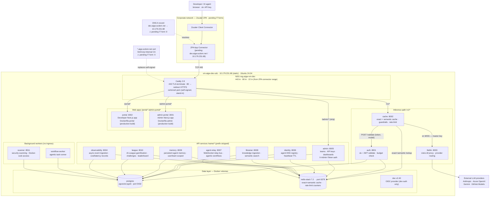

# Dev environment — single-host deployment

**Status:** Running · Phase 1 stabilisation · updated 2026-06-18
**Host:** `vm-aigw-dev-sdc` · `10.179.231.68` (static private IP) · Sweden Central
**ZPA virtual IP:** `100.64.1.34` (Zscaler-assigned, routes to `10.179.231.68`)
**DNS:** `dev.aigw.scdom.net` → `100.64.1.34` ✅ resolving
**TLS cert:** self-signed `O=SimCorp, CN=dev.aigw.scdom.net` (90-day stand-in, expires 2026-09-16) — cert and Caddy confirmed working on-box
**ZPA status:** TCP routing active (443/80/22 all reachable) · ⚠️ TLS passthrough must be enabled in ZPA policy for port 443 — currently ZPA is intercepting TLS rather than passing it through
**SSH:** `ssh azureuser@dev.aigw.scdom.net` (RSA key auth, via ZPA)

---

## Overview

The dev environment runs the full ai-gw stack as a single Docker Compose project on one Linux VM in the Azure dev Landing Zone. This replaced Azure Container Apps (ACA) for the stabilisation phase — ACA required a Landing Zone policy waiver and a public DNS ownership proof, neither of which are needed when the stack is just containers behind a Caddy TLS terminator on a VNet IP.

See [`docs/superpowers/specs/2026-06-17-single-host-stabilization-deployment-design.md`](../superpowers/specs/2026-06-17-single-host-stabilization-deployment-design.md) for the full design rationale.

---

## Environment diagram




---

## Container inventory

All 18 containers verified healthy on 2026-06-18 (VM uptime 20h+):

| Container | Image | Port (host) | Status |
|---|---|---|---|
| caddy | `caddy:2.8-alpine` | 443, 80 | Up |
| auth | `ai-gateway-auth` | 127.0.0.1:8001 | healthy |
| cache | `ai-gateway-cache` | 127.0.0.1:8002 | healthy |
| litellm | `ai-gateway-litellm` | 127.0.0.1:8003 | healthy |
| observability | `ai-gateway-observability` | 127.0.0.1:8004 | healthy |
| admin | `ai-gateway-admin` | 127.0.0.1:8005 | healthy |
| identity | `ai-gateway-identity` | 127.0.0.1:8006 | healthy |
| agent-relay | `ai-gateway-agent-relay` | 127.0.0.1:8007 | healthy |
| librarian | `ai-gateway-librarian` | 127.0.0.1:8008 | healthy |
| memory | `ai-gateway-memory` | 127.0.0.1:8009 | healthy |
| league | `ai-gateway-league` | 127.0.0.1:8010 | healthy |
| scanner | `ai-gateway-scanner` | 127.0.0.1:8011 | healthy |
| portal | `ai-gateway-portal` | 127.0.0.1:3002 | healthy |
| admin-portal | `ai-gateway-admin-portal` | 127.0.0.1:3001 | healthy |
| workflow-worker | `ai-gateway-workflow-worker` | — | Up |
| postgres | `pgvector/pgvector:pg16` | 127.0.0.1:5432 | healthy |
| redis | `redis/redis-stack:7.2.0-v14` | 127.0.0.1:6379 | healthy |
| dex | `dexidp/dex:v2.40.0` | 127.0.0.1:5556 | Up |

All service ports are bound to `127.0.0.1` (loopback) — only Caddy binds `0.0.0.0:443` and `0.0.0.0:80`.

---

## How to manage the stack

```bash
# SSH to the VM (once ZPA/SSH is active)
ssh azureuser@dev.aigw.scdom.net

# Or via az run-command (no ZPA needed, runs as root)
az vm run-command invoke \
  --resource-group rg-spoke-platformaitooling-dev-sdc-001 \
  --name vm-aigw-dev-sdc \
  --command-id RunShellScript \
  --scripts 'su -c "cd /home/azureuser/ai-gw/infra && docker compose -f docker-compose.yml -f docker-compose.host.yml ps" azureuser'

# Restart a single service
cd /home/azureuser/ai-gw/infra
docker compose -f docker-compose.yml -f docker-compose.host.yml up -d --no-deps <service>

# View logs
docker logs ai-gateway-<service>-1 --tail 50 -f

# Rebuild and restart portals (needed after NEXT_PUBLIC_* changes)
docker compose -f docker-compose.yml -f docker-compose.host.yml build --no-cache portal admin-portal
docker compose -f docker-compose.yml -f docker-compose.host.yml up -d --no-deps portal admin-portal
```

---

## Compose files

| File | Purpose |
|---|---|
| `infra/docker-compose.yml` | Base definition — all 18 services. Internal ports bound to `127.0.0.1`. |
| `infra/docker-compose.host.yml` | Host overlay — adds the `caddy` service with `0.0.0.0:443` + `0.0.0.0:80`. Always used together with the base. |
| `infra/Caddyfile` | Caddy routing rules — TLS termination + path-based proxy to all services. |
| `infra/certs/` | TLS cert/key (gitignored). Self-signed stand-in until IT form ① is fulfilled. |
| `.env` | VM-local secrets (gitignored, mode 0600). Source of truth for provider keys. |

---

## Caddy routing table

| Path pattern | Target | Notes |
|---|---|---|
| `/v1/*` | `cache:8002` | Inference entry point; `handle` (prefix kept) |
| `/portal*` | `portal:3002` | Next.js basePath — prefix must be kept |
| `/admin-portal*` | `admin-portal:3001` | Next.js basePath — prefix must be kept |
| `/admin/*` | `admin:8005` | `handle_path` — prefix stripped |
| `/cache/*` | `cache:8002` | `handle_path` |
| `/litellm/*` | `litellm:8003` | `handle_path` |
| `/identity/*` | `identity:8006` | `handle_path` |
| `/librarian/*` | `librarian:8008` | `handle_path` |
| `/memory/*` | `memory:8009` | `handle_path` |
| `/league/*` | `league:8010` | `handle_path` |
| `/observability/*` | `observability:8004` | `handle_path` |
| `/agent-relay/*` | `agent-relay:8007` | `handle` (WebSocket — prefix kept) |
| `/auth/*` | `admin:8005` | Admin serves login/OIDC flows at `/auth/*` |
| `/healthz` | `"ok" 200` | Caddy synthetic health probe |
| `/` | redirect `/portal/` | Landing page convenience |

**Key distinction:** `handle` keeps the URL prefix when proxying; `handle_path` strips it.
Next.js apps use `handle` because their `basePath` config expects the prefix to arrive at the app.

---

## Inference path detail

```
caller (Bearer sk-...)
  → Caddy :443  /v1/chat/completions
  → cache :8002
      POST auth:8001/validate  {token: "sk-...", model: "claude-haiku-4-5"}
        returns  {team_id, key_id, scopes, scope}  or 401/429
      Redis  exact-match lookup  (key = sha256(prompt+model+params))
        HIT  → return cached completion  (x-cache: HIT)
        MISS → litellm:8003  /v1/chat/completions  (Authorization: Bearer <master-key>)
               → Anthropic / Azure OpenAI / Gemini / GitHub Models
               → response stored in Redis
               → return to caller  (x-cache: MISS)
```

The **auth service** has only three endpoints: `POST /validate`, `GET /health`, `GET /ready`.
It is **not** the ingress — it is called internally by cache to validate tokens. The request
never goes `caller → auth → cache`; it goes `caller → Caddy → cache`, with cache calling auth
as a dependency.

---

## API key management

Teams are stored as `organization_nodes` (not a `teams` table). The root SimCorp org node UUID is:

```
1ff78788-938b-4e7d-bf81-24765ee48c41
```

To create an API key from the VM:

```bash
curl -s -X POST \
  "http://localhost:8005/teams/1ff78788-938b-4e7d-bf81-24765ee48c41/keys" \
  -H "Content-Type: application/json" \
  -H "X-Admin-Token: $(grep ADMIN_TOKEN /home/azureuser/ai-gw/.env | cut -d= -f2)" \
  -d '{"name":"my-key"}'
# → {"id":"...","key":"sk-...","scopes":["ai-gw:inference:*"],...}
```

`ADMIN_TOKEN` must be set in `/home/azureuser/ai-gw/.env` — see `.env.example` for the variable name.

---

## Access edge

| IT form | Status | Detail |
|---|---|---|
| ① Certificate `*.aigw.scdom.net` | ⏳ Pending | SimCorp Internal CA — PEM + key. Once received: copy to `infra/certs/` on VM, `docker compose restart caddy` |
| ② DNS `dev.aigw.scdom.net` | ✅ Done | A record → `100.64.1.34` (ZPA virtual IP), resolving from corp workstations |
| ③ ZPA app segment | ✅ Active (partial) | TCP routing on 443/80/22 confirmed working. **TLS passthrough not yet enabled** — ZPA is intercepting HTTPS; needs to be set to passthrough in ZPA admin console for port 443 |

**Network path (current):**
```
Developer workstation
  → Zscaler Client Connector
  → ZPA (100.64.1.34 virtual IP → 10.179.231.68 VM private IP)
  → NSG nsg-aigw-vm-dev (443/80/22 from ZPA connector range)
  → VM 10.179.231.68
  → Caddy :443 (TLS, self-signed cert O=SimCorp CN=dev.aigw.scdom.net)
```

**To complete HTTPS access:**
1. Enable TLS passthrough in ZPA admin for `dev.aigw.scdom.net` port 443
2. Install production `*.aigw.scdom.net` cert when IT form ① is fulfilled

**SSH access** (confirmed working 2026-06-18):
```bash
ssh azureuser@dev.aigw.scdom.net   # RSA key auth via ZPA
```

---

## Deployment insights

### What worked well

- **Caddy as TLS front-door** is simpler than the ACA ingress model. No `Host` header rewriting needed — containers on the same Compose network talk to each other by service name directly.
- **Self-signed cert + `auto_https off`** lets Caddy work immediately with a known cert without ACME/Let's Encrypt DNS challenges, which don't work on an internal VNet.
- **`handle` vs `handle_path`** is the key Caddyfile distinction: Next.js apps need their `basePath` prefix kept (`handle`); FastAPI services strip it (`handle_path`).
- **`az vm run-command`** lets the agent manage the VM without ZPA/SSH being available yet — every compose operation was done via run-command.

### Env var quirks discovered

- **Pydantic v2 `list[str]` fields require JSON array syntax** in env files: `CORS_ORIGINS=["a","b"]`, not comma-separated. Comma-separated silently fails to parse.
- **`db-migrate` needs `env_file`** — it imports the same `Settings()` as the admin service and requires ~12 fields (redis_url, secret_key, oidc_issuer, etc.). Without `env_file`, startup fails with a Pydantic `ValidationError` listing all missing fields.
- **`ADMIN_TOKEN` is required to create API keys** via the admin service. Without it, `POST /teams/{id}/keys` returns `500 {"detail":"ADMIN_TOKEN not configured"}` even though the endpoint has no explicit auth dependency — the auth middleware is applied at router registration time.
- **`RELAY_SECRET` maps to env var name `RELAY_SECRET`**, not `AGENT_RELAY_SECRET` (the compose env key that was in the old file). Pydantic field name determines the env var name.
- **LiteLLM `DATABASE_URL`** must use `postgresql://` (not `postgresql+asyncpg://`). LiteLLM uses Prisma, which does not accept the asyncpg driver prefix.

### Architecture insight: where auth lives in the request path

A common misconception: the **auth service is not the ingress**. It validates tokens but does not proxy. The actual path is:

```
caller → Caddy → cache (calls auth as a dep) → litellm
```

The auth service exposes only `POST /validate` — it is a validation oracle, not a gateway.
The cache service is the real orchestrator of the hot path: it extracts the Bearer token, calls auth, checks Redis, and forwards to litellm with the master key.

### Portal `NEXT_PUBLIC_*` vars are baked in at build time

Next.js bakes `NEXT_PUBLIC_*` environment variables into the static build output — they cannot
be changed at container start time. If the API URLs change, the portal images must be rebuilt.
The portals are now built from `Dockerfile.portal` and `Dockerfile.admin` with all `NEXT_PUBLIC_*`
vars pointing to `https://dev.aigw.scdom.net`. Rebuild command:

```bash
docker compose -f docker-compose.yml -f docker-compose.host.yml build --no-cache portal admin-portal
docker compose -f docker-compose.yml -f docker-compose.host.yml up -d --no-deps portal admin-portal
```

### Landing Zone cleanup (completed)

- ACA environment deleted — `ME_cae-aigw-dev-sdc_rg-aigw-dev-sdc_swedencentral` is a leftover managed RG with 3 LB metric resources; Azure will clean it up automatically.
- AZWESU0005 managed identity: no role assignments on this subscription — already clean.
- Private DNS zone `aigw-dev.lab.cloud.scdom.net` already points to `10.179.231.68` — no action needed.

---

## Pending items

| Item | Status | Action |
|---|---|---|
| DNS `dev.aigw.scdom.net` | ✅ Done | Resolves to `100.64.1.34` from corp workstations |
| SSH access via ZPA | ✅ Done | `ssh azureuser@dev.aigw.scdom.net` works |
| ZPA TLS passthrough | ⚠️ Action needed | In ZPA admin console: set port 443 app segment to TLS passthrough (not inspection) |
| Production cert `*.aigw.scdom.net` | ⏳ Pending IT form ① | Once received, copy to `infra/certs/cert.pem` + `key.pem` on VM then `docker compose restart caddy` |
| Inference test (cache MISS → HIT) | ⏳ Blocked | Set `ANTHROPIC_API_KEY` in VM `.env`: `ssh azureuser@dev.aigw.scdom.net "sed -i 's/^ANTHROPIC_API_KEY=\$/ANTHROPIC_API_KEY=sk-ant-YOUR_KEY/' ~/ai-gw/.env && cd ~/ai-gw/infra && docker compose -f docker-compose.yml -f docker-compose.host.yml up -d --no-deps litellm"` |
